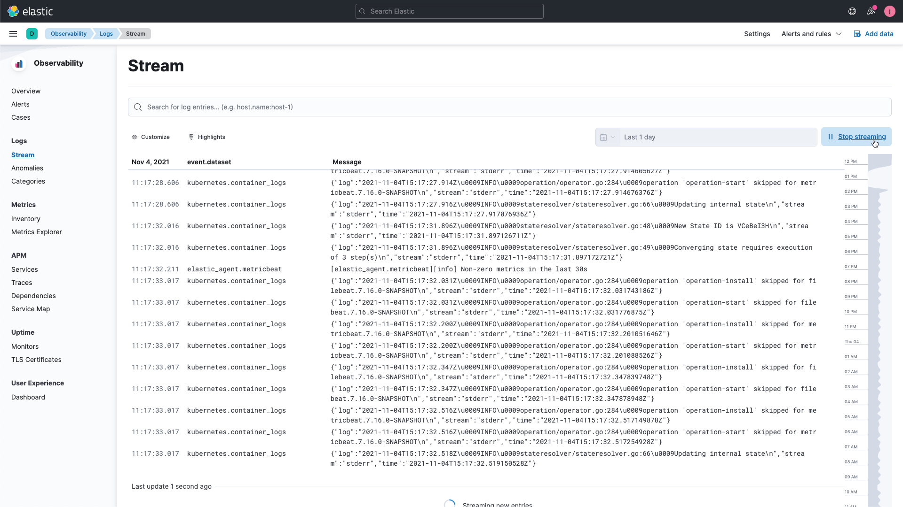
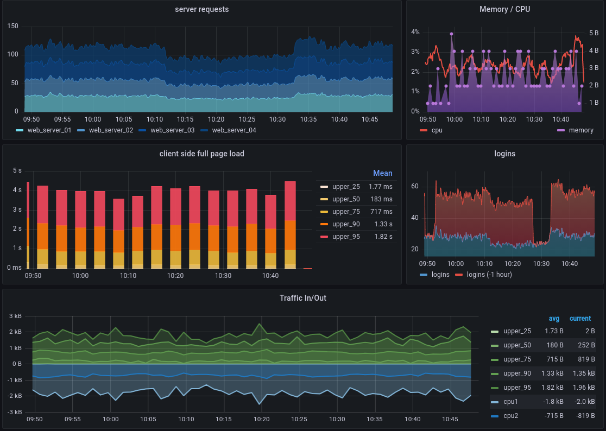
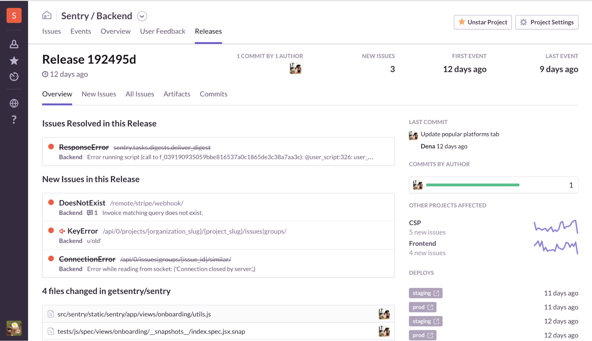

[🏠](../README.md)

# Konsep Dasar
*Monitoring* (PENGAMATAN) merupakan sebuah alat/konsep dimana kita berusaha memahami bagaimana sebuah perangkat lunak bekerja disebuah lingkungan jarak jauh / *remote environments*. Hal ini dilakukan bertujuan untuk komponen perangkat lunak berupa kutu(bug) dapat didiagnosis / pekerjaan operasional dapat dilakukan.

Sedangkan *Observability* (PEMANTAUAN) adalah alat / konsep bagaimana sebuah  perangkat lunak bisa dipahami hanya dengan melihat keluaran *output*(data), bertujuan agar perangkat lunak yang sedang beroperasi bisa dinilai berdasarkan beberapa hal.

# Tujuan *Observability & Monitoring*
Tujuan dari *Observability & Monitoring* dalam pengembangan perangkat lunak adalah untuk memastikan bahwa sistem perangkat lunak berjalan dengan baik, kinerja dan keandalannya terjaga, serta memberikan pengalaman pengguna yang baik. Berikut adalah beberapa tujuan *Observability & Monitoring* secara lebih rinci

## Memantau Secara Real Time
Memantau sistem perangkat lunak secara real time untuk memastikan kinerja sistem berjalan dengan baik, sehingga apabila terjadi masalah pada perangkat lunak bisa diambil sebuah tindakan, misalnya bila terjadi gangguan sistem, penurunan layanan, bug, dan aktivitas yang tidak diizinkan

## Memahami Penyebab Masalah pada Sistem
Pemasangan *Observability & Monitoring* dapat memberikan kita kemampuan untuk bisa memahami bagaimana *behaviour* sistem. Hal ini sangat penting dalam sistem modern yang terdistribusi, yang cukup kompleks dan sulit dipahami tanpa bantuan *Observability & Monitoring* yang tepat. Terutama tanda-tanda terjadinya gangguan sistem, penurunan layanan, bug, dan aktivitas yang tidak diizinkan.

## Memperbaiki Pengembangan Produk
Memperbaiki proses pengembangan produk dengan memberikan  wawasan tentang bagaimana sistem atau aplikasi beroperasi di lingkungan produksi. Hal ini dapat membantu engineer dalam membuat keputusan yang lebih baik tentang bagaimana mengembangkan dan menguji produk mereka.

# Komponen *Observability & Monitoring*
Monitoring and observability bisa didapatkan dengan kita beberapa komponen, seperti *Log*, *Metric* dan *Tracking*. Beberapa *monitoring* bahkan sampai pada *tracking* dan *reporting events*, yang bisa merepresentasikan interaksi pengguna pada sistem / perubahan pada sistem itu sendiri. 

## *Log*
Kumpulan informasi mengenai sebuah event yang muncul di aplikasi atau sistem, seperti pesan galat, permintaan ke *server*. Misalnya "User Menekan Tombol X" yang didalamnya termasuk metadata seperti kapan event tersebut terjadi, *server* mana yang memproses, dan *environtment* seperti apa yang memprosesnya. Log data akan di-*generate* oleh Monitoring and Observability yang berisikan data-data atau informasi yang didapatkan dari berbagai sumber misalnya saja mengenai tanggal kejadian, penggunaan *network*, *dataset*, *network*, *compute* dan *storage*. Hal ini akan memudahkan pengembang untuk bisa menemukan *anomalies* didalam *sistem* sehingga bisa dilakukan *troubleshoot* pada masalah tersebut.

## *Metric*
*Metric* merupakan data mentah mengenai penggunaan / *behaviour* dari monitoring system yang didapatkan dari application atau service di infrastruktur kita. Data yang didapatkan biasanya berupa angka-angka yang berasal dari penggunaan CPU, *Storage*, *Request per second*, *Memory* dst. Data-data *metric* tersebut, bisa digunakan untuk mengukur efisiensi, kinerja dan kesehatan dari *application* / *service* yang ada serta untuk mengenai trend / *behaviour* dari *application* / *service* yang ada. 

## *Tracking*
*Tracing* merupakan sebuah alur yang dimulai dari *request* sebuah aplikasi dari awal hingga selesai yang dilakukan oleh user maupun sebuah event pada *service* / *application*. *Tracking* biasanya berbentuk sebuah grafik air terjun yang bisa menggambarkan perjalanan/alur untuk bisa memahami setiap kali event terjadi apa saja yang telah dilewati, berapa lama, melewati *server* mana saja, antriannya seperti apa dst.
 

# Jenis jenis *Observability & Monitoring*
Pada tulisan ini, saya membedakan antara *Observability & Monitoring* untuk aplikasi dan sistem. Kita akan menyebut Application Performance Management (APM) dan System Monitoring. 

## Aplikasi Monitoring kinerja (APM)
APM berfokus kepada *monitoring* di bagian *application layer* dan *end user experience*. *Application layer* seperti *Web Server*, *Database*,* Web Apps* untuk bisa *track response time*, *error rate* dan memberikan  *visibility* ke dalam infrastruktur dan dependensi yang mendasari dari aplikasi. Goalnya adalah membantu Developer untuk *tracking*, *profiling* dan mencari akar permasalahan kepada pengembang apabila terjadi sebuah masalah.

- [Elastic APM](https://www.elastic.co/observability/application-kinerja-monitoring)
- [Grafana APM](https://grafana.com/grafana/dashboards/3837-application-kinerja/)
- [NewRelic APM](https://newrelic.com/platform/application-monitoring)

## System Monitoring
System monitoring berfokus kepada memonitor layer pada OSI Model, termasuk *Observability & Monitoring* untuk perangkat keras, jaringan, *server* dan sistem operasi dimana fokusnya kepada kesalahan/cacat, ketersediaan *server*, jaringan dan OS Parameter. System monitor, memberikan fitur seperti *alerting*, *reporting* dan *capacity planing* untuk membatu administrator dalam identifikasi dan menyelesaikan sebuah masalah. Beberapa contoh Aplikasi untuk System Monitoring seperti
- [Datadog](https://www.datadoghq.com/)
- [Grafana](https://grafana.com/grafana/dashboards/8003-system-monitoring/)
- [Elastic Infrastructure Monitoring](https://www.elastic.co/observability/infrastructure-monitoring)

# Kesimpulan
Monitoring (pengamatan) dan Observability (pemantauan) adalah konsep penting dalam pengembangan perangkat lunak yang bertujuan untuk memastikan kinerja, keandalan, dan pengalaman pengguna yang baik. Dengan menggunakan komponen seperti *Log*, *Metric*, dan *Tracking*, *Observability & Monitoring* memungkinkan pemahaman terhadap perilaku sistem, identifikasi masalah, dan pengambilan tindakan yang tepat. Jenis-jenis monitoring, seperti APM dan System Monitoring, memberikan kemampuan untuk memantau performa aplikasi dan infrastruktur, serta membantu pengembang dan administrator dalam mengatasi masalah dan meningkatkan kualitas sistem secara keseluruhan.

# Referensi
- [DevOps Measurement Monitoring and Observability](https://cloud.google.com/architecture/devops/devops-measurement-monitoring-and-observability#:~:text=Monitoring%20is%20tooling%20or%20a,to%20actively%20debug%20their%20system.)
- [Monitoring and Observability: Know the Difference](https://www.linkedin.com/pulse/monitoring-observability-know-difference-madhav-kashyap/)
- [*OBSERVABILITY & MONITORING*: AN ULTIMATE GUIDE.](https://openupthecloud.com/observability-monitoring-ultimate-guide/)
- [Log Monitoring](https://www.elastic.co/what-is/log-monitoring)